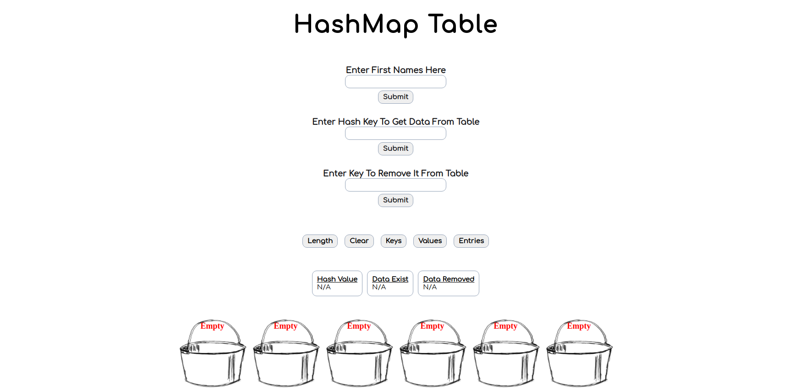

# HashMap Project

## Introduction
HashMap is a data structure that stores data into a bucket storage system. The data is usually a string type
that is passed into a hash function and outputted as a hash code. The hash code is a numeric or alphanumeric 
string. Hashing the same input should always return the same hash code, and there should be no random generation
component. 

Buckets will appear as an array data structure that will store the hash code data. The hash function returns a number
that serves as the index of the array at which we store this specific value pair. This number will also represent
the key. Example using the name John:
1. Pass <b>John</b> into the hash function to get the hash code which is <b>12</b>.
2. Find the bucket at index <b>12</b>.
3. Store the key value pair in that bucket. 

Collisions should be avoided, if possible. A Collision occurs when two different keys generate the exact same hash code. 
Because they have the same hash code, they will land in the same bucket. There are many hash functions and specialized
techniques that can help prevent collisions, but none are perfect, which means collisions still find a way to creep
in. However, for this project, if a key already exists, then the old value is overwritten and updated with the new value. 

## Hash Function
There are various hash function methods that can be implemented. The <b>Mod Method (hash by division)</b> will be used 
for this project. In this method we map a key into one of the slots by taking the remainder of <b>key</b> divided by
<b>table_size</b>. That is, the hash function is:

hashCode = number % table_size;

When using the division method, we usually avoid certain values of <b>table_size</b>. <b>table_size</b> should not be the value
from the power of a number. It has been found that the best results with the division method are achieved when the table size is
prime. However if <b>table_size</b> is prime, an additional restriction is called for. 

A prime not to close to an exact power of 2 is often good choice for <b>table_size</b>:
 
2^4 = 16, 17 for the <b>table_size</b> is to close to an exact power of 2. 

2^5 = 32 & 2^6 = 64, maybe a prime number between 32 and 64 would be more suitable. 

## Assignment
1. Create a <b>Hash(key)</b> function that takes a key and produces a hash code with it.

2. Create a <b>set(key, value)</b> function that takes two arguments. The first is a key and
the second is a value that is assigned to this key. If a key already exists, then the old value
is overwritten or we can say that we update the key's value.

3. Create a <b>get(key)</b> function that takes one argument as a key and returns the value that is assigned
to this key. If a key is not found, return <b>null</b>.

4. Create a <b>has(key)</b> function that takes a key as an argument and returns <b>true</b> or <b>false</b> based on
whether or not the key is in the hash map. 

5. Create a <b>remove(key)</b> function that takes a key as an argument. If the given key is in the hash map, it should
remove the entry with that key and return <b>true</b>. If the key isn't in the hash map, it should return <b>false</b>.

6. Create a <b>length()</b> functon that returns the number of stored keys in the hash map.

7. Create a <b>clear()</b> funciton that removes all the entries in the hash map. 

8. Create a <b>keys()</b> function that returns an array containing all the keys inside the hash map.

9. Create a <b>values()</b> function that returns an array containing all the values.

10. Create a <b>entries()</b> function taht returns an array that contains each <b>key, value</b> pair.
Example: <b>[[firstKey, firstValue], [secondKey, secondValue]]</b>

Hash map do not preserve insertion order when you are retrieving your hash map's data. It is normal and expected for
keys and values to appear out of the order you inserted them in. 

## Live Demo
[HashMap Project](https://ibn12.github.io/odin-hashmap/)